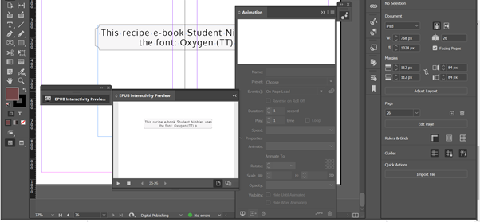

As I am currently designing a small recipe ebook I thought I would write a blog, not only as an abstract log of this journey but to also give a little advice to anyone who may want to create a mini-recipe ebook. So now we commence...

What makes a good recipe book? Is it solely the recipe of the entire format of the book? Is it the design?

Arguably it's that and more.

Do you remember my previous blog on the different ebook [formats](https://www.creativestudiosderby.co.uk/fixed-layout-vs-reflowable-epubs-indesign-ebook-formats-explained/): *fixed-layout* and *reflowable?* (Go back if you're not too sure about what I'm talking about 😊) Well, definitely take this into consideration when choosing to make a Recipe ebook.

A fixed-layout allows you to take interactivity into your cookbook, and is a potentially a better option than reflowable as you can as sound, animated images and videos.

Whilst constructing a recipe book on InDesign try to remember a few things (in no particular order):

1. Co-ordination: Make sure that your double-spreads are enough for each theme that you plan to have for your ebook

   * Ensure that you pick the correct template size and format for your book as well
2. Your own taste, creativity and imagery!
3. Interactivity: Ensure that you make this ebook appeal to the masses by animating text and images
4. Good recipes: Look at your recipes and ensure if they are appetising enough to your audience
5. Trial and error: Like most things in this world - things needed to be tested to ensure the best UX (user experience)

   * Download an ePub Reader to see what your ebook looks like outside of InDesign
   * Use the ePub interactivity preview tab on InDesign (Window/Interactive) to see if your animations are what you actually want

     

**Bonus tip! Don't forget your imprint, colophon and title spread** (p.s colophons traditionally come at the end of books and state the production information of the book e.g font type