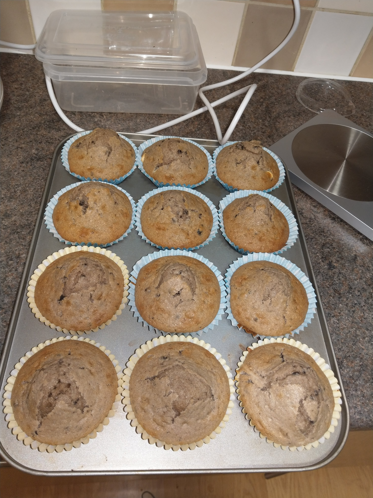

Blueberry Muffins a lovely variation of the vanilla muffin! (If you are not a fan of blueberries leave them out or swap them for another fruit or chocolate chips.)

**Serves:** Eight large muffins/ten medium-sized muffins/20-22 mini muffins 

**Prep time:** 10 minutes

**Cook time:** 20 minutes/ 9-12 minutes for mini-muffins

**Tip!** If you plan on making the larger muffins, we recommend adding 1 to 2 tablespoons of water into any empty muffin cases that you have available. This way the cups with water will heat up at the same rate as the cups with muffin batter which will help the muffins bake more evenly.

### Ingredients

* 195 grams plain flour
* 150 grams granulated sugar
* 1/4 teaspoon fine sea salt
* 2 teaspoons baking powder
* 80 ml vegetable oil
* 1 large egg
* 80 ml – 120 ml milk – dairy and non-dairy are fine
* 1 1/2 teaspoons vanilla extract
* 125 grams fresh or frozen blueberries – do not defrost the berries

### Method

**STEP 1**
Pre-heat oven to 200ºC/fan 220ºC/gas 7.

**STEP 2**
Whisk the flour, sugar, baking powder, and salt in a large bowl.

**STEP 3**
Add the 80 ml oil to a measuring jug that holds at least 240ml. Add the egg then fill the jug to the 240 ml mark with milk. Add vanilla and whisk to combine.

**STEP 4**
Add milk mixture to the bowl with dry ingredients then use a fork to combine. Do not over mix. (The muffin batter should be quite thick but scoopable. Fold in the blueberries.

**STEP 5**
Divide the batter between muffin cups. If you desire muffin-tops make sure the mixture is quite close the top.

**STEP 6**
Bake muffins 15 to 20 minutes or until tops are no longer wet and a toothpick inserted into the middle of a muffin comes out with crumbs, not wet batter. Transfer to a cooling rack.