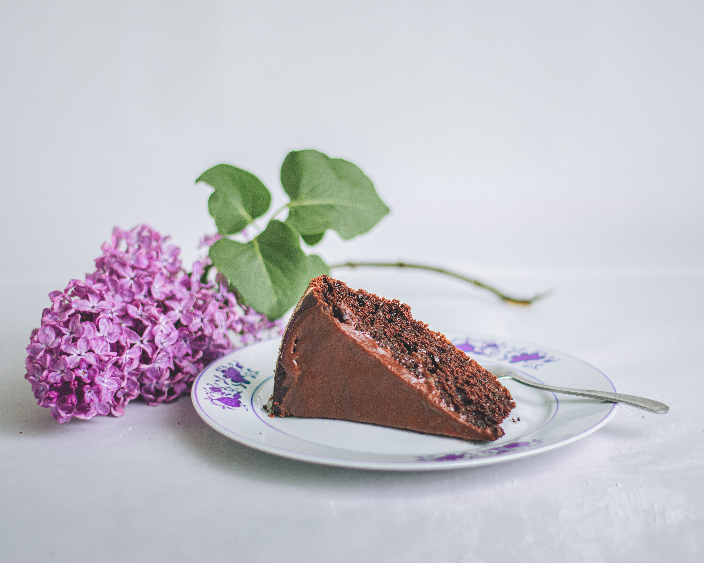

Here is a superb recipe for when you want brownies and cake combined!

###### Prep time: 10 minutes
Cook time: 30-40 minutes

### Ingredients

* 100g butter
* 100g caster sugar
* 100g brown sugar
* 125g dark chocolate
* 1 tbsp golden syrup
* 2 eggs
* 1 tsp vanilla extract/essence
* 100g plain flour
* ½ tsp baking powder
* 2 tbsp cocoa powder

### Method

**STEP 1**
Heat oven to 180C/fan 160C/gas 4. Grease and line your cake tin.

**STEP 2**
Melt butter, both sugars, chocolate and golden syrup gently in a pan on a low heat until mixture is smooth and lump-free.

**STEP 3**
Remove the pan from the heat, set aside.

**STEP 4**
Break the eggs into a bowl and whisk with vanilla extract or essence. When light and frothy, mix the flour, baking powder and cocoa powder into the chocolate mixture and mix thoroughly.

**STEP 5**
Put the mixture into the greased and lined cake tin and place on the middle to lower part of the oven. Bake for 30 mins. If the cake is wobbly cook for another 10 minutes or until it firms.

**STEP 6**
Remove and allow to cool for 20-30 mins before cutting into wedges and serving.

**Optional**
Serve by itself, or decorate as you wish, perhaps with some ice cream or fruit.