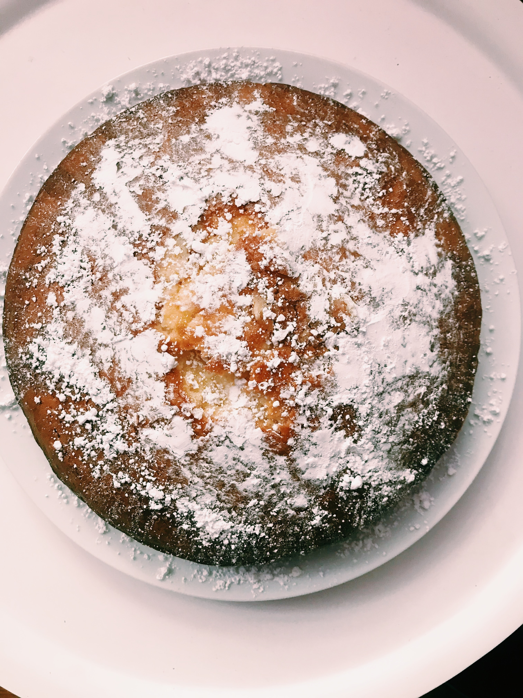

Here is an easy recipe for a light and citrusy lemon cake. However if fruit-flavoured cake is not what your heart desires than feel free to remove the lemon side of things and bake a vanilla cake instead.

**Prep time: 10 minutes**

**Cook time: 40-45 minutes**

### Ingredients

* 225 g self-raising flour
* 2 tsp baking powder
* 4 medium eggs
* 225 g soft margarine or butter
* 225 g caster sugar
* 2 tsp milk
* Zest of 2 lemons

### Optional Step – Lemon Buttercream

* 300g icing sugar
* 120g unsalted butter
* 20ml lemon juice
* 1 teaspoon lemon zest
* 1 tablespoon milk

### Method

**STEP 1**
Preheat your oven to 160ºC/ fan 140ºC/ gas 3. Grease and line your baking tin.

**STEP 3**
Finely grate the zest of two lemons and sift the self-raising flour and baking powder into a large bowl.

**STEP 4**
Add the eggs, soft margarine or butter, caster sugar, and 2 tsp milk and beat by hand (feel free to use an electric mixer if you have one on stand-by) until combined and smooth. Ensure that there aren’t any small lumps of butter/margarine in your mixture. 

**STEP 5**
Pour the mixture into the tin and bake for 40-45 minutes. To check if the cake is cooked insert a skewer into the centre and if it comes out clean the cake is ready.
Leave the cake to cool in the tins for about 10 minutes. Remove them from the tins and then move them to a wire rack to cool completely – Make sure the cake has cooled completely before decorating.

**Optional**
Decorate cake with lemon buttercream – mix all ingredients listed together to make a smooth thick mixture (do not over-mix). Alternatively dust on some icing sugar.