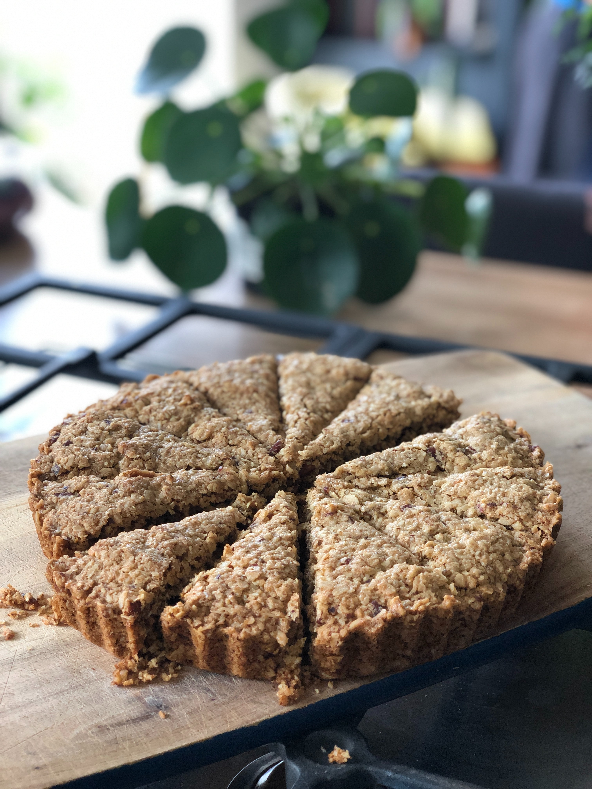

**Prep time: 5 minutes**

**Cook time: 25 minutes**

### Ingredients

* 150g butter
* 75g light brown sugar
* 3 tbsp golden syrup
* 250g porridge oats

### Method

**STEP 1**
Preheat the oven to 180C/160C fan oven/ gas 4 and grease and line your baking tray and cake tin.

**STEP 2**
Put the butter, sugar and golden syrup into a medium pan and stirring regularly till the butter melts and the rest of the ingredients have combined.

**STEP 3**
Once the butter is melted, bring the pan off the heat and pour in the oats, making sure to cover each oat within the mixture.

**STEP 4**
Pour the new mixture into the tin and make sure to spread it out evenly by using a spoon or a knife.

**STEP 5**
Bake for 25 minutes or until brown around the sides.

**STEP 6**
Remove from the oven and leave to cool down for 10 minutes before taking it out of the cake tin or tray and serving.