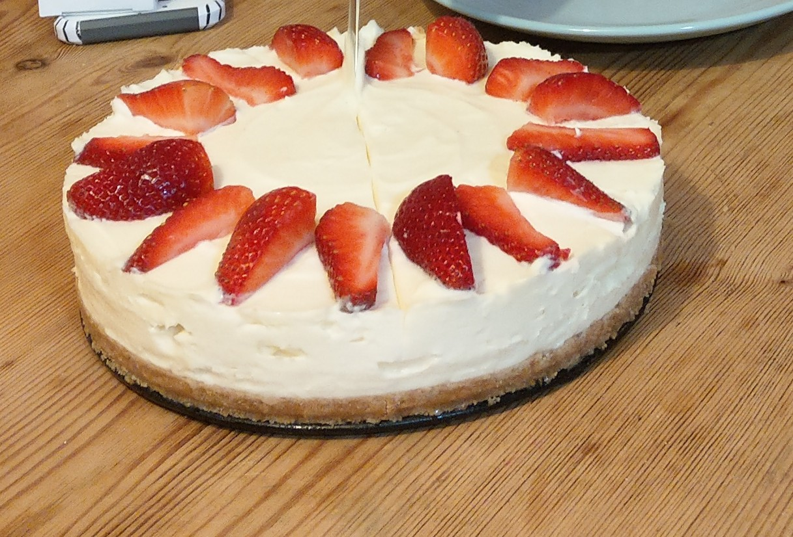

A sweet, sweet choice.

**Prep time: 1 hour 30 minutes plus overnight set**

**Cook time: 0 minutes**

### Ingredients

* 250g digestive biscuits
* 100g butter, melted
* 3 ½ tbsp vanilla extract/essence
* 600g full fat soft cheese
* 100g icing sugar
* 284ml pot of double cream

  ### **For the topping**
* 400g of strawberries, halved
* 25g icing sugar

### Method

**STEP 1**
To make the base, butter and line a (preferably) a loose-bottomed tin with baking parchment. Put the digestive biscuits in a plastic food bag and crush to crumbs using a rolling pin. Transfer the crumbs to a bowl, then pour melted butter over the crumbs. Mix thoroughly until the crumbs are completely coated. Tip them into the prepared tin and press firmly down into the base to create an even layer. Chill in the fridge for 1 hr to set firmly.

**STEP 2**
Pour the vanilla and the double cream into a bowl and whisk with an electric mixer or fork until it is just starting to thicken to soft peaks. Place the soft cheese and icing sugar in a separate bowl, then beat for 2 mins with an electric mixer or fork until it starts to thicken, it will get thin and then start to thicken again.

**STEP 3**
Tip in the double cream and fold it into the soft cheese mix. You are looking for it to be thickened enough to hold its shape. (Take a spoonful of the mixture and tip the spoon upside down – should not drop). If it’s not thick enough, continue to whisk.

**STEP 4**
Spoon onto the biscuit base, starting from the edges and working inwards, making sure that there are no air bubbles. Smooth the top of the cheesecake down with the back of a dessert spoon or spatula. Leave to set in the fridge overnight.

**STEP 5**
Bring the cheesecake to room temperature about 30 mins before serving. To remove it from the tin, place the base on top of a can, then gradually pull the sides of the tin down. Slip the cake onto a serving plate, removing the lining paper and base.

**STEP 6**
Place the strawberries unto the top of the cheesecake – decorate as you wish. Feel free to decorate however you wish or to leave/substitute the strawberries.