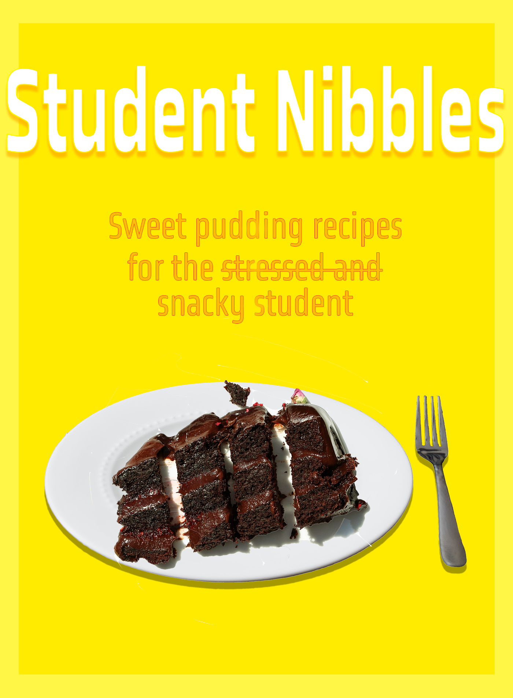

Focusing on other practical tasks can be a good way to relax when stressed with assignments. Here are some basic recipes that students do not need to spend a lot of money on, or time, and can still study whilst waiting for the food to finish baking in the oven.

